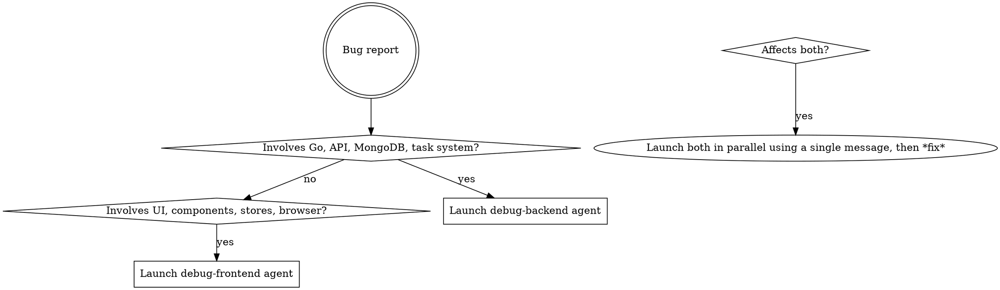

# Debug

Orchestrates the full debug-to-fix pipeline for weblens bugs. Routes to the correct debug agent(s) based on where the bug lives, then passes the diagnosed root cause to the correct fix agent(s).

## Decision: Backend or Frontend?

### Backend signals

- Error in Go code, test failure in `./scripts/test-weblens.bash`
- HTTP 500, wrong API response, missing/wrong data in MongoDB
- Task system issue (scan, upload, zip, backup not completing)
- Auth/permission bug (middleware, route guards)
- File path or portable path issue
- Anything in `routers/`, `services/`, `models/`, `modules/`

### Frontend signals

- UI not rendering, wrong display, visual bug
- Playwright test failure
- Pinia store state incorrect
- WebSocket messages not handled
- Component interaction bug (click does nothing, wrong navigation)
- Anything visible in the browser or related to user interaction
- Anything in `weblens-vue/weblens-nuxt/`

### Ambiguous? Launch both debug agents in parallel using a SINGLE message.

## Phase 1: Diagnose

Run multiple debug agent invocations in a SINGLE message. For example, if the bug is ambiguous, you can launch both debug agents at the same time. Or, just 1 if that's all that is needed.

The debug agents will:

1. Reproduce the bug
2. Isolate the code path
3. Identify the root cause
4. Write a _failing_ test
5. Report back with: root cause, affected files/lines, failing test location

**Wait for the debug agents to complete before proceeding.**

## Phase 2: Plan the fix

Before launching the fix agents, review the debug agents' output to understand the root cause and the failing test. This is crucial for ensuring the fix agent has the correct context to implement an effective fix.
Use a planner agent to synthesize the debug agents' outputs into a clear plan for the fix agent. This plan should include:

- A concise summary of the root cause
- The specific behavior that needs to be changed (as captured by the failing test)
- The exact files and lines that are affected and likely need changes
- The location of the failing test that must pass after the fix

## Phase 3: Fix

Take the plan from the previous step and launch the appropriate fix agent(s). Always launch these in a SINGLE message, ensuring they launch in parallel.

Pass these to the fix agents verbatim:

- **Root cause** — the debugger's diagnosis
- **Failing test** — file path and test name
- **Affected files** — specific files and line numbers to change

The fix agent will:

1. Read the failing test and affected code
2. Implement the minimum fix
3. Run the test to confirm it passes
4. Run the full test suite
5. Run lint

## Phase 3: Verify

After the fix agent completes, verify the result:

1. Confirm the fix agent reported all tests passing
2. Confirm lint passed
3. If either failed, resume the fix agent with the failure details

## Quick reference

| Step              | Agent            | Model  | Purpose                            |
| ----------------- | ---------------- | ------ | ---------------------------------- |
| Diagnose backend  | `debug-backend`  | opus   | Root-cause Go/API/DB bugs          |
| Diagnose frontend | `debug-frontend` | opus   | Root-cause UI/component/store bugs |
| Fix backend       | `fix-backend`    | sonnet | Implement Go fix + tests           |
| Fix frontend      | `fix-frontend`   | sonnet | Implement Vue/Nuxt fix + tests     |
