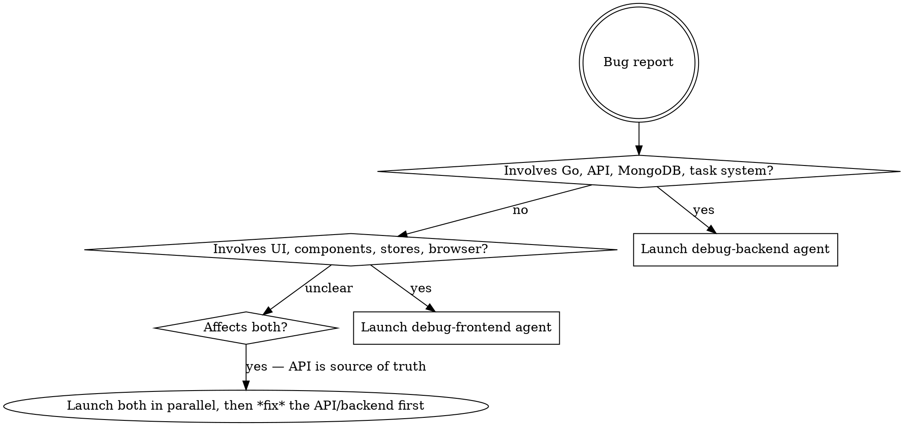

# Debug

Orchestrates the full debug-to-fix pipeline for weblens bugs. Routes to the correct debug agent based on where the bug lives, then passes the diagnosed root cause to the correct fix agent.

## Decision: Backend or Frontend?



### Backend signals

- Error in Go code, test failure in `./scripts/test-weblens.bash`
- HTTP 500, wrong API response, missing/wrong data in MongoDB
- Task system issue (scan, upload, zip, backup not completing)
- Auth/permission bug (middleware, route guards)
- File path or portable path issue
- Anything in `routers/`, `services/`, `models/`, `modules/`

### Frontend signals

- UI not rendering, wrong display, visual bug
- Playwright test failure
- Pinia store state incorrect
- WebSocket messages not handled
- Component interaction bug (click does nothing, wrong navigation)
- Anything visible in the browser or related to user interaction
- Anything in `weblens-vue/weblens-nuxt/`

### Ambiguous? Launch both debug agents in parallel, but fix backend first if both find issues.

When the API returns wrong data and the UI shows wrong data, the bug is almost always in the backend. Debug the API response first — if the API is correct, then debug the frontend.

## Phase 1: Diagnose

Launch the appropriate debug agent with the full bug report:

```
Agent(subagent_type="debug-backend" OR "debug-frontend", prompt=<bug details>)
```

The debug agent will:

1. Reproduce the bug
2. Isolate the code path
3. Identify the root cause
4. Write a *failing* test
5. Report back with: root cause, affected files/lines, failing test location

**Wait for the debug agent to complete before proceeding.**

## Phase 2: Fix

Take the debug agent's output and launch the appropriate fix agent:

```
Agent(subagent_type="fix-backend" OR "fix-frontend", model="sonnet", prompt=<root cause + failing test + affected files>)
```

Pass these to the fix agent verbatim:

- **Root cause** — the debugger's diagnosis
- **Failing test** — file path and test name
- **Affected files** — specific files and line numbers to change

The fix agent will:

1. Read the failing test and affected code
2. Implement the minimum fix
3. Run the test to confirm it passes
4. Run the full test suite
5. Run lint

## Phase 3: Verify

After the fix agent completes, verify the result:

1. Confirm the fix agent reported all tests passing
2. Confirm lint passed
3. If either failed, resume the fix agent with the failure details

## Cross-boundary bugs

If the debug agent discovers the bug spans both backend and frontend:

1. Fix backend first, (API is source of truth) - but only after understanding the full picture from BOTH debug agents. If the backend is the root cause, then fixing it should resolve the frontend issue as well.
2. If the frontend also needs changes, you can launch the frontend fix agent after the backend fix is complete.

Launch `fix-backend` first, wait for completion, then launch `fix-frontend` if the frontend also needs changes.

## Quick reference

| Step              | Agent            | Model  | Purpose                            |
| ----------------- | ---------------- | ------ | ---------------------------------- |
| Diagnose backend  | `debug-backend`  | opus   | Root-cause Go/API/DB bugs          |
| Diagnose frontend | `debug-frontend` | opus   | Root-cause UI/component/store bugs |
| Fix backend       | `fix-backend`    | sonnet | Implement Go fix + tests           |
| Fix frontend      | `fix-frontend`   | sonnet | Implement Vue/Nuxt fix + tests     |
