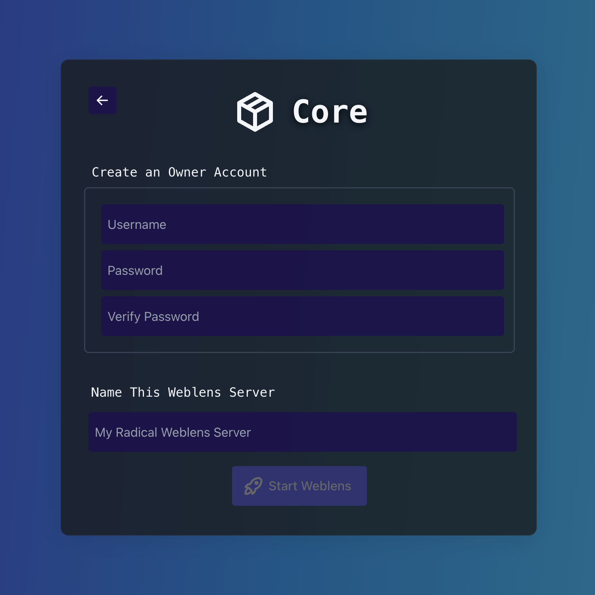
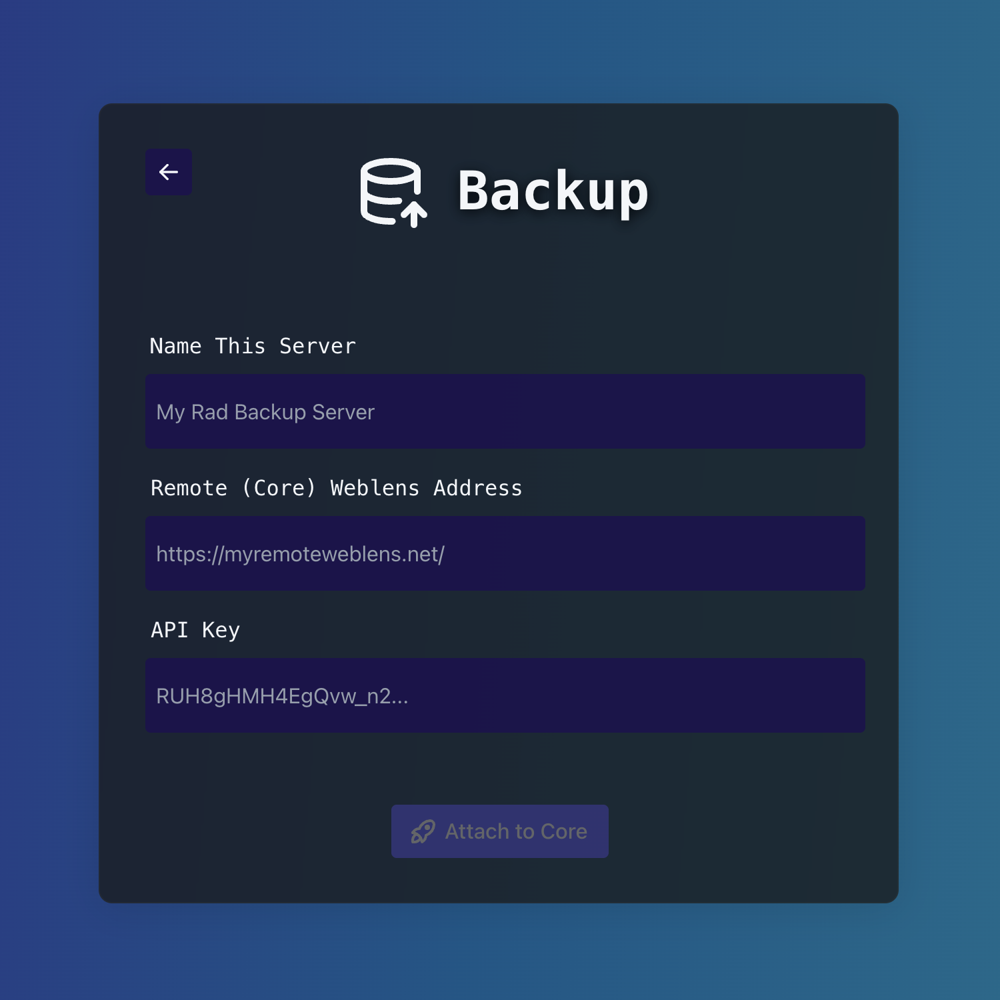

<h1 align="center">Weblens</h1>
<h3 align="center">Self-Hosted file manager and photo server</h3>

<p align="center">
    
    <br/>
    <br/>    
    <a href="https://github.com/ethanrous/weblens/actions/workflows/go.yml"></a>
    
</p>
<br/>

# Overview

Weblens is a self-hosted file and photo management system that boasts a simple and snappy experience.

## Features lightning round
* File management, including history, backup, and restore
* Clean, productive web interface
* Users, permissions & sharing of both files and media
* Photo gallery and albums
* API (not yet stable, documentation coming soon)

### Experimental Features
* WebDav

<br/>

# Ready to get started?
## Installation
Weblens is distributed as a Docker container, which can be configured minimally as such:
```bash
docker run --name weblens \
-p 8080:8080 \ 
-v /files/on/host:/media/users \ 
-v /cache/on/host:/media/cache \
-e MONGODB_URI="mongodb://{{ MONGO_USER }}:{{ MONGO_PASS }}@weblens-mongo:27017"
docker.io/ethrous/weblens:latest
```
Weblens uses MongoDB. This can easily be setup using another container
```bash
docker run --name weblens-mongo \
-v /db/on/host:/data/db \
-e MONGO_INITDB_ROOT_USERNAME: {{ MONGO_USER }} \
-e MONGO_INITDB_ROOT_PASSWORD: {{ MONGO_PASS }} \
mongo
```
Replace `{{ MONGO_USER }}` and `{{ MONGO_PASS }}` with a (database) username and password of your choosing.

Replace all of the `/(files | cache | db)/on/host` with paths on your host where you want your data stored.

⚠️ **Note** If you have both fast and slow storage, the "files" path should go on the large slow media, and the "cache" and "db" should be on the fast cache.

⚠️ **Note** Having the containers on the same Docker network is extremely helpful, as it allows Docker to do DNS for you, and does not require you to open the port on your Mongo container. [Read how to set up a Docker network](https://docs.docker.com/reference/cli/docker/network/create/). If the containers cannot be on the same network, you will need to add `-p 27017:27017` to the Mongo container, and change the "weblens-mongo" in the `MONGODB_URI` to a route the container will understand without Docker DNS.

## Setup
Once you have the containers configured and running, you can begin setting up your Weblens server. 

In your browser, head to the url for your server. If you are running this container locally, it would be `http://localhost:8080`, but if you are running this on another machine, have changed the port, or are using TLS it will be different.

Once connected, you will see a screen like this, where you have 2 options, [Weblens Core](#weblens-core) and [Weblens Backup](#weblens-backup)


### Weblens Core
If this is your main Weblens server, you will want to set up a *core* server. Alternatively, if you already have a core server and want to create an offsite backup, see [Weblens Backup](#weblens-backup)

Configuring a core server is very simple



1. Create a user. This will be the "owner" of the server
   - This user is automatically an admin, as well. There can be many admin users, but only ever one owner
   - The owner is still a regular user, however, so there is no need for both an "owner" and "personal" account
2. Give this server a name, use whatever you like!
   - This will be the name shown to identify this server if connected to other instances
3. Hit "Start Weblens", and you're good to go! 🥳
   - If prompted, login with the account you just created

### Weblens Backup

⚠️ **Note** that a Backup server requires an existing [core server](#weblens-core), and to be set up by an admin of that server



1. Give your server a name. Again, it can be anything!
   - If you have hosts `host1` and `host2` and `host2` is a backup of `host1`, don't name it `host1-backup`, simply name it `host2`
   - Support for a backup server to back up multiple core servers is planned for the future
2. Add the public address where the core server can be reached
3. Generate an API key to allow access to the core server
   1. Navigate to the "files" page on your existing core server
   2. Open the admin settings menu via the button on the top right of the page
   3. Click `New Api Key` under the `API Keys` header, then click the clipboard to copy the new key
   4. Return to the weblens backup setup, paste your new API key in the "API Key" box
4. Hit "Attach To Core", then login as an existing user on the core server

Bonus: In admin settings on the core server, you can now view the status of your backup server

<br/>

# Want to contribute?

Weblens aims to be feature-full and rock-solid stable, but it is still early in development (the term "beta" may be pushing it), so it is likely to have bugs or missing features. Bug reports, feature suggestions, and pull requests are all welcome and encouraged here on GitHub 

## Development Setup
Weblens has a few dependencies that are needed for developing. Easy install instructions per platform are listed below

* Go 1.23
* LibVips
* MongoDB
* ExifTool
* Node and NPM for the React/Vite frontend

### MacOS
```bash
brew tap mongodb/brew &&
brew install go@1.23 mongodb-community vips mongodb-community@7.0 exiftool node npm &&
brew services start mongodb-community
```

### Linux (Ubuntu)
⚠️ On Ubuntu, installing the Go compiler and MongoDB have a few extra steps.
[Install Go compiler on Linux](https://go.dev/doc/install)
and
[Install MongoDB on Ubuntu](https://www.mongodb.com/docs/manual/tutorial/install-mongodb-on-ubuntu/)
```bash
sudo apt update &&
sudo apt-get install -y pkg-config libvips-dev exiftool nodejs npm
```

### Building / Testing
Once you have successfully installed the dependencies for your platform, the easiest way to ensure your environment is correctly set up is by running 
```bash
./scripts/testWeblens
```
This will build the frontend and backend, and run the backend tests. If you are pulling from the main branch, these tests should pass. If this is the case: Congrats! You are ready to start writing! 

If they don't, there is likely a configuration issue. Please re-read the instructions and ensure the environment is set up as described, and if there is still an issue, please be descriptive in asking for help on the [issues page](https://github.com/ethanrous/weblens/issues)

### Debugging

Building and running the server can be done with the following in the shell
```bash
./scripts/startWeblens
```
This should start your Weblens server running at `localhost:8080`. To change the host, port or other config options such as log level, see `./config/config.json` and edit the `DEBUG-CORE` config section, or create your own section.

In an IDE, you will need to choose the entry point for the compiler to `./cmd/weblens/main.go`. You will also need to set the following environment variables (make sure to replace `{{ WEBLENS_REPO }}` with the full path to this repo):

```
CONFIG_NAME=DEBUG-CORE
CONFIG_PATH={{ WEBLENS_REPO }}/config
```

### WebUI
After starting your Weblens server, in a separate shell, you can run:
```bash
cd ./ui && npm start
```
This will launch the web UI at `localhost:3000`, and proxy requests to the server running at `localhost:8080`.

If the port is already in use, vite will pick the next port not in use, check the logs for which port it is using, however it will likely open in browser for you, so you don't need to worry about that. If you'd like to choose the port yourself, set `VITE_PORT`.

If you must change the Weblens server address or port, make sure to set `VITE_PROXY_HOST` and `VITE_PROXY_PORT` in the environment before running `npm start`
