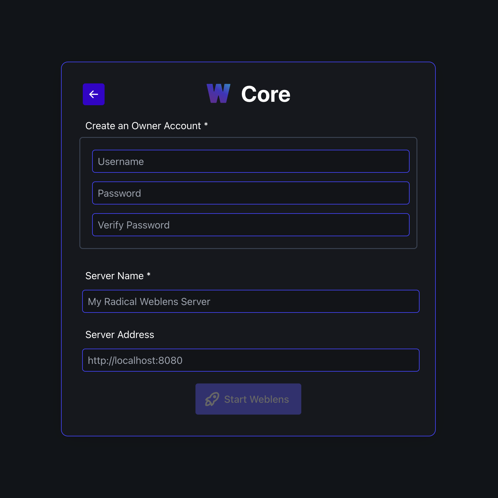

<h1 align="center">Weblens</h1>
<h3 align="center">Self-Hosted file manager and photo server</h3>

<p align="center">
    
    <br/>
    <br/>    
    <a href="https://github.com/ethanrous/weblens/actions/workflows/go.yml"></a>
    
</p>
<br/>

# Overview

Weblens is a self-hosted file and photo management system that aims to provide a simple and snappy experience.

## Features lightning round
* File management: including history, backup, and restore
* Fuzzy file search by name
* Clean, productive web interface
* Users, permissions & sharing of both files and media
* Media viewing and management, including video and raw photo support, metadata editing, and more
* API (still likely to include breaking changes with future updates, documentation at /docs/index.html on any weblens server)
* Focus on performance and overall user experience

### Roadmap
* Search and organization
   * File and media tagging and improved search
   * Local machine learning support for image recognition
* Backup
   * Improved support for file history management (this is a priority as files are never deleted, only marked as such)
   * Core "emulation" for backup servers
   * Restore individual files from backup server
   * Direct backup to cloud storage providers
* Improved metadata editing 
* WebDav support

<br/>

# Ready to get started?
## Installation
Weblens is distributed as a Docker image. Here is a minimal docker setup to get started:
```bash
docker run --name weblens \
-p 8080:8080 \ 
-v /files/on/host:/media/users \ 
-v /cache/on/host:/media/cache \
-e MONGODB_URI="mongodb://{{ MONGO_USER }}:{{ MONGO_PASS }}@weblens-mongo:27017"
docker.io/ethrous/weblens:latest
```
Also, Weblens uses MongoDB. This can easily be setup using another container
```bash
docker run --name weblens-mongo \
-v /db/on/host:/data/db \
-e MONGO_INITDB_ROOT_USERNAME: {{ MONGO_USER }} \
-e MONGO_INITDB_ROOT_PASSWORD: {{ MONGO_PASS }} \
mongo
```
Replace `{{ DOUBLE_BRACES }}` with values specific to your setup.

⚠️ **Note** Having the containers on the same Docker network is extremely helpful. [Read how to set up a Docker network](https://docs.docker.com/reference/cli/docker/network/create/). If you wish not to do this, you will have to modify the MONGODB_URI to something routable, and export port 27017 on the mongo container.

If you prefer to use docker-compose or want view the other configuration options, a sample [docker-compose.yml](scripts/docker-compose.yml) is provided in the scripts directory.

## Setup
Once you have the containers configured and running, you can begin setting up your Weblens server. 

By default, Weblens uses port 8080, so I will be using `http://localhost:8080` as the example url here

A Weblens server can be configured as a ["core"](#weblens-core) server, or as a ["backup"](#weblens-backup) server. A core server is the main server that is used day to day, and an optional backup server is a one that mirrors the contents of 1 or more core servers. Ideally a backup server is physically distant from any core it backs up.


### Weblens Core
If you are new to Weblens, you will want to set up a *core* server. Alternatively, if you already have a core server, and instead want to create an offsite backup, see setup instructions for a [Weblens Backup](#weblens-backup) server.

Configuring a core server is simple. You will need to create a user, give the server a name, and optionally set the server address (e.g. if it is behind a reverse proxy)



Once you have set up your core server, you will be dropped into the main page. From here, you can begin uploading and organizing files, and inviting other users to share with.

### Weblens Backup

Weblens backup servers are designed to be a simple set-and-forget solution to keep your data safe. Unlike a core server, which needs to be accessible on the internet (or via VPN, etc.) for a backup server to work, a backup server can be setup behind a firewall or on a private network, and just needs to be able to reach the core server.

⚠️ **Note** that a Backup server requires an existing [core server](#weblens-core), and for you to be an admin of that server

To configure a backup server, give it a name, the public address of the core server, and an API key generated by the core server.


After setting up your backup, in the "remotes" section of the settings on your core server, you can now view the status of your backup server.

In the event of a disaster that takes out your core server, you can perform a "restore" operation on your backup server, and all your data will be restored to a new core server of your choosing. If, instead, you just want protection from accidental deletion of files, a core server has this functionality built in, and would not be aided by a backup server in this scenario.

<br/>

# Want to contribute?

Weblens aims to be feature-full and rock-solid stable, but it is still early in development (the term "beta" may be pushing it), so it is likely to have bugs or missing features. Bug reports, feature suggestions, and pull requests are all welcome and encouraged here on GitHub 

## Development Setup
Weblens has a few dependencies that are needed for developing. Easy install instructions per platform are listed below

* Go 1.23
* LibVips
* ImageMagick
* MongoDB
* ExifTool
* Node and NPM for the React/Vite frontend

### MacOS
```bash
brew tap mongodb/brew &&
brew install go@1.23 mongodb-community vips imagemagick mongodb-community@7.0 exiftool node npm &&
brew services start mongodb-community
```

### Linux (Ubuntu)
⚠️ On Ubuntu, installing the Go compiler ImageMagick, and MongoDB have a few extra steps.
[Install Go compiler on Linux](https://go.dev/doc/install)
and
[Install MongoDB on Ubuntu](https://www.mongodb.com/docs/manual/tutorial/install-mongodb-on-ubuntu/)
```bash
sudo apt update &&
sudo apt-get install -y pkg-config libvips-dev exiftool nodejs npm
```
Building ImageMagick from source is recommended on Linux, as the version in the package manager is often outdated. [Instructions here](https://imagemagick.org/script/install-source.php). ImageMagick version 7 is required, which is correctly pulled with apk on Alpine Linux (like inside our docker containers), but version 6 is still pulled from apt on Ubuntu.

### Building / Testing
Verify the environment is set up correctly by running tests (run with --help for more options):
```bash
./scripts/testWeblens -a -l
```
If they pass: Congrats! You are ready to start contributing!

If they don't, there is likely a configuration issue. Please re-read the instructions and ensure the environment is set up as described. If there is still an issue, please be descriptive in asking for help on the [issues page](https://github.com/ethanrous/weblens/issues)

⚠️ **Note** that scripts must be run from the repo root, you cannot be in the scripts directory or anywhere else

### Debugging

Building and running the server can be done with the following in the shell
```bash
./scripts/startWeblens
```
This should start your Weblens server running at `localhost:8080`. To change the host, port or other config options such as log level, see `./config/config.json` and edit the `DEBUG-CORE` config section, or create your own section.

In an IDE, you will need to choose the entry point for the compiler to `./cmd/weblens/main.go`. You will also need to set the following environment variables (`{{ WEBLENS_REPO }}` is the absolute path to this repo, i.e. `$(pwd)`):

```
CONFIG_NAME=DEBUG-CORE
APP_ROOT={{ WEBLENS_REPO }} 
```

### WebUI
After starting your Weblens server, in a separate shell, you can run:
```bash
cd ./ui && npm install && npm start
```
This will launch the web UI at `localhost:3000` (if it is not in use), and proxy requests to the server running at `localhost:8080`.

If you'd like to choose the port yourself, set `VITE_PORT`. If you change the backend server address or port, make sure to set `VITE_PROXY_HOST` and `VITE_PROXY_PORT` in the environment before running `npm start`
