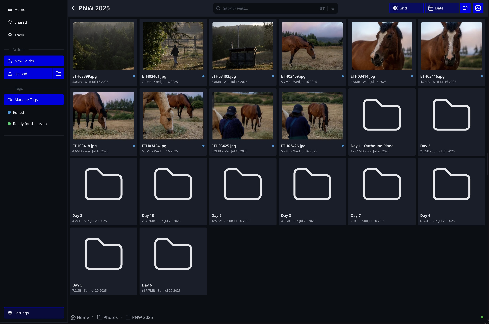
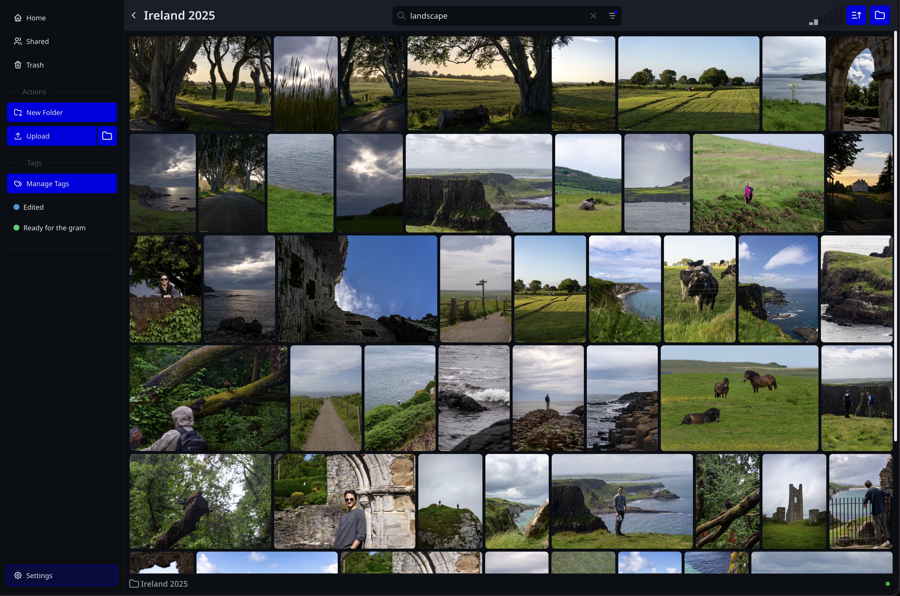
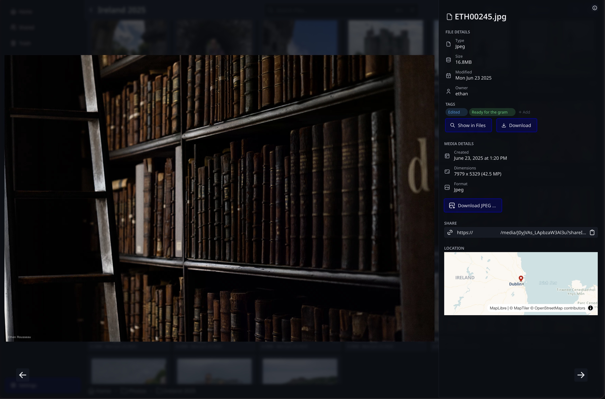
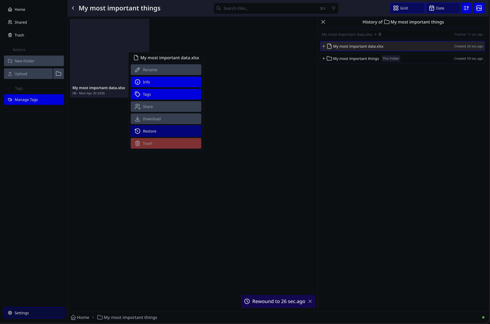

<h1 align="center">Weblens</h1>
<h3 align="center">Self-hosted file manager and photo server</h3>

<p align="center">
    
    <br/><br/>
    
</p>

---

Weblens is a self-hosted file management server. It runs as a Docker container, stores files on your own hardware, and gives you a web UI to upload, organize, browse, and share them.

## Features

- **File management** - upload, organize, rename, delete, and move files through a web interface.
  - Files are not encrypted, the file structure is exactly what you see in the UI.
- **File history** - view full history of any file, and restore deleted or overwritten files without a separate backup tool.
- **Sharing** - share files and folders with other users or via anonymous guest links, with granular permissions.
- **Media browser** - view photos and videos in-browser, including RAW formats and video playback.
  - View EXIF metadata such as GPS coordinates, capture date, resolution, and more.
- **Search** - fast full-text search across filenames and metadata.
  - Local ML-based image recognition. Search for objects, concepts, or text and find it instantly.
- **Backup server** - run a second Weblens instance as an offsite mirror of your primary server.
- **REST API** - documented at `/docs/index.html` on any running instance.

## Installation

Weblens is distributed as a Docker image. The easiest way to get started is with Docker Compose.

Refer to the example [compose](docker/example.compose.yaml) and [.env](docker/example.compose.env) files in the `docker` directory to get set up.

Edit `.env` to set the three paths:

```env
DATA_HOST_PATH=/path/to/your/data       # Where user files are stored (plain, not encrypted)
CACHE_HOST_PATH=/path/to/your/cache     # Where thumbnails and temp files go
DATABASE_HOST_PATH=/path/to/your/db     # Where MongoDB stores its data
```

> The `DATA_HOST_PATH` is your long-term file storage - point it at wherever you have space. `CACHE_HOST_PATH` benefits from fast storage (SSD) since it holds thumbnails and processed media.

## Setup

On first launch, Weblens will prompt you to configure the server. You can set it up as a **core** server or a **backup** server.

### Core server

A core server is the primary instance you use day-to-day. Configure it with an owner account, a server name, and optionally a public address if it's behind a reverse proxy.

### Backup server

A backup server mirrors one or more core servers. It only needs outbound access to the core - it does not need to be publicly accessible.

To set one up, you need an API key (in settings -> account) on your core server's owners account. Now, on the backup server, give the backup server a name, the core servers public address, and that key.

In the event of a disaster on your core server, the backup server can restore all data to a new core instance. If you only need protection against accidental deletion, the built-in file history on the core server is sufficient - a separate backup instance is optional.

## Configuration

There are two ways to configure Weblens:

1. Through environment variables, which are set in the `.env` file
2. Through the admin interface at `/settings/dev`

These two methods of are not mutually exclusive - you can use both at the same time, and have some, but not complete, feature overlap. Configuration you set in the admin interface will be stored in the DB, and will override environment variables.

## Screenshots






## Roadmap

- Better file and media tagging with improved, unified search
- WebDAV support
- Direct backup to cloud storage providers
- Restore individual files from a backup server

## Contributing

Bug reports, feature requests, and pull requests are welcome. See [CONTRIBUTING.md](CONTRIBUTING.md) for development setup instructions.
